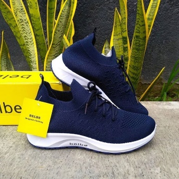
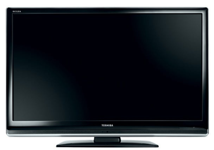
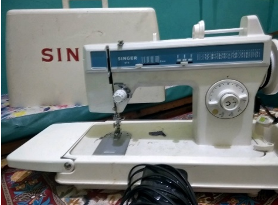

# Laporan Praktikum Pertemuan 1

## Pertanyaan dan Jawaban Percobaan
1. Jelaskan perbedaan antara objek dengan class!
Jawaban : objek merupakan titisan dari class, yang mempunyai state(atribut) dan behavior(perilaku) dan dimodelkan mirip dengan objek dunia nyata, Class adalah blueprint atau konsep dari objek yang akan dibuat. Dan objek tidak akan ada jika tidak ada class, dan class tidak akan bisa digunakan jika objeknya belum dibuat.
2. Jelaskan alasan warna dan tipe mesin dapat menjadi atribut dari objek mobil!
Jawaban : karena warna dan tipe mesin mempunyai procedural seperti mengganti warna/tipe mesin dan juga warna dan tipe mesin dapat membedakan objek satu dengan objek yang lain.
3. Sebutkan salah satu kelebihan utama dari pemrograman berorientasi objek dibandingkan
dengan pemrograman struktural!
Jawaban : pada pemrograman berorientasi objek lebih dapat dipahami layaknya Bahasa manusia, dan lebih ringkas dari pada pemrograman struktural.
4. Apakah diperbolehkan melakukan pendefinisian dua buah atribut dalam satu baris kode seperti
“public String nama,alamat;”?
Jawaban : boleh, dikarenakan tipe data yang digunakan sama.
5. Pada class SepedaGunung, jelaskan alasan atribut merk, kecepatan, dan gear tidak lagi ditulis di
dalam class tersebut!
Jawaban : : karena sudah ada kode program extends Sepeda, yaitu mengacu pada Class Sepeda (parents nya adalah Class Sepeda).

## Tugas Praktikum
Hasil dari identifikasi 4 objek disekitar saya , yang diantaranya 2 objek adalah mengandung konsep pewarisan (inheritance) diantaranya adalah :
1. Sepatu
2. Televisi
3. Mesin Jahit (listrik)
4. Mesin Obras

Gambar 
1. Sepatu

•	Value : ukuran, merek, warna
•	Behavior : tambah ukuran. Kurang ukuran, pilih warna, pilih merek

2. TV

•	Value : merek, channel,volume
•	Behavior : set merek, set channel, tambah volume, kurang volume

3. Mesin Jahit

•	Value : merek, warna benang, kecepatan(pedal), tuas jarak, pola jahitan
•	Behavior : set merek, set warna benang, tambah kecepatan, kurang kecepatan, set jarak jahitan, berapa pola

4. Mesin Obras

•	Value : merek, 3-4 benang, kecepatan(pedal)
•	Behavior: set merek, set jumlah benang, tambah kecepatan, kurang kecepatan

 